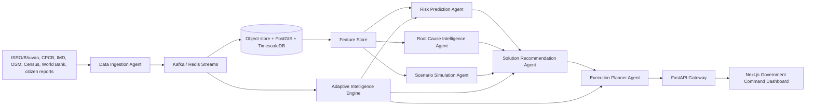

# BharatSustain AI Architecture

## Dynamic recalculation loop

1. Data ingestion agent accepts live observations and validates region/metric contracts.
2. Streaming backbone persists raw events and triggers feature refresh.
3. Risk prediction agent recomputes severity, urgency, impact radius, and confidence for all configured horizons.
4. Root-cause agent refreshes causal dependency weights.
5. Solution agent re-ranks interventions by impact, feasibility, budget, carbon reduction, and ROI.
6. Execution planner updates milestones, manpower, agencies, dependencies, and KPIs.
7. Alerts are emitted when severity or policy failure thresholds are crossed.
